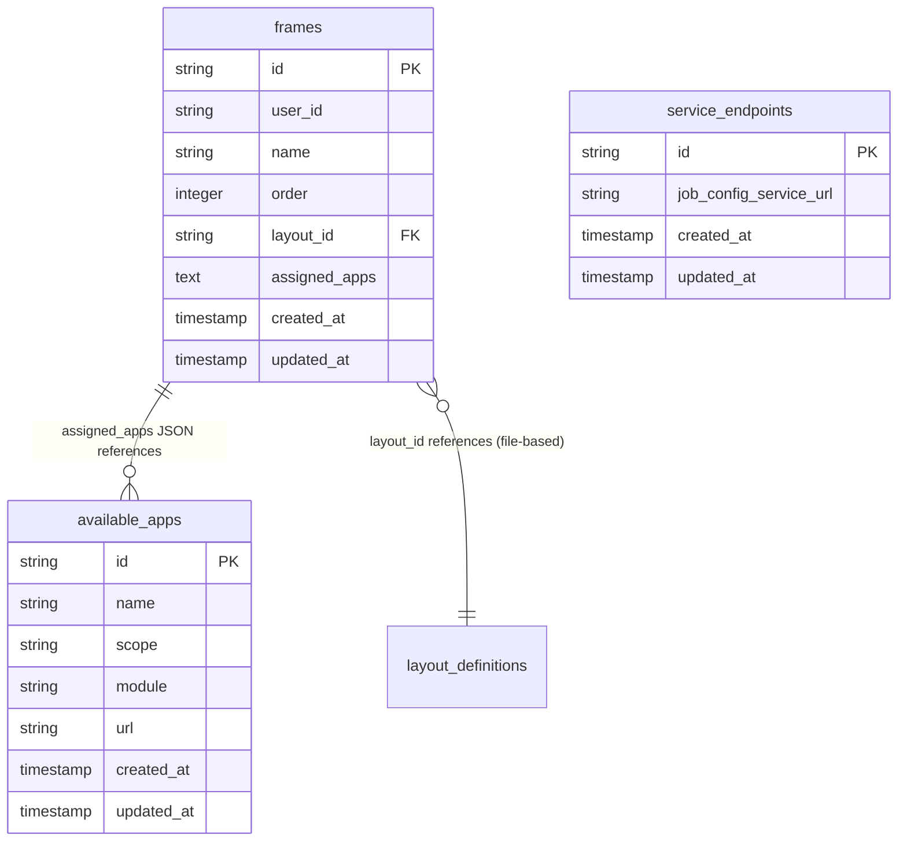
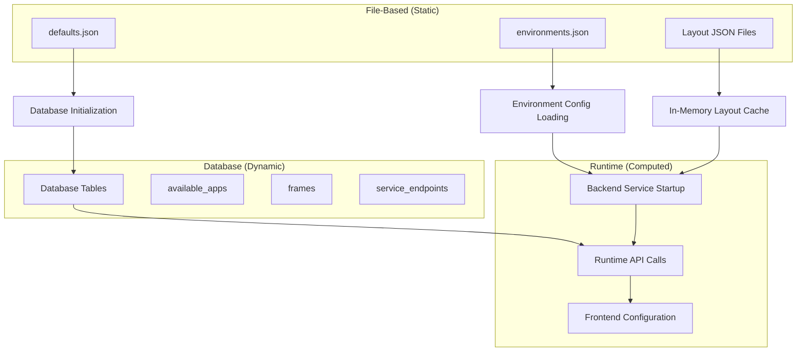
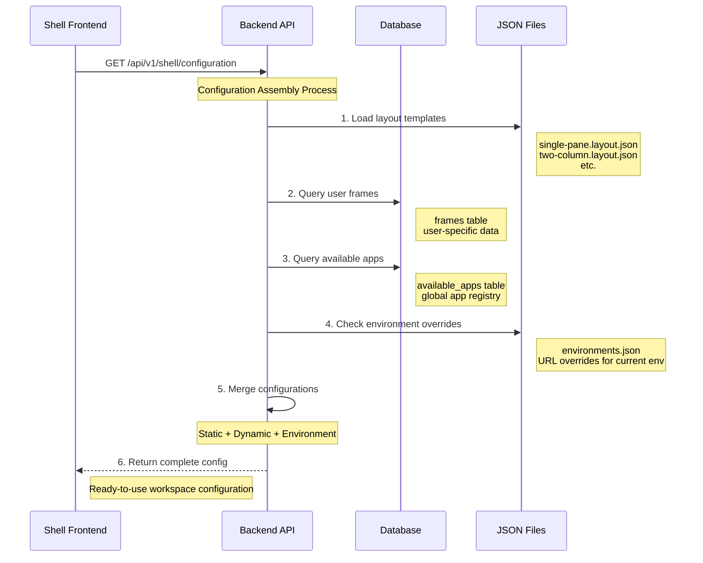
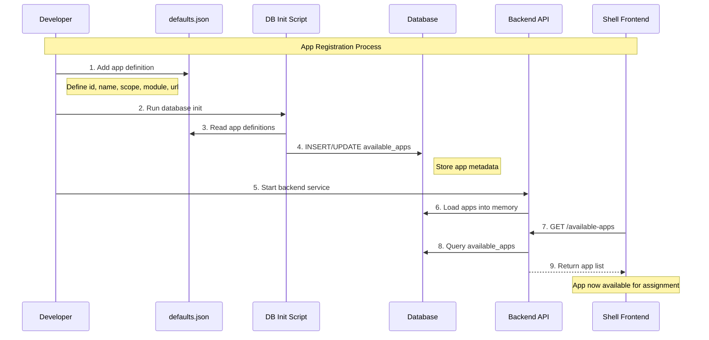
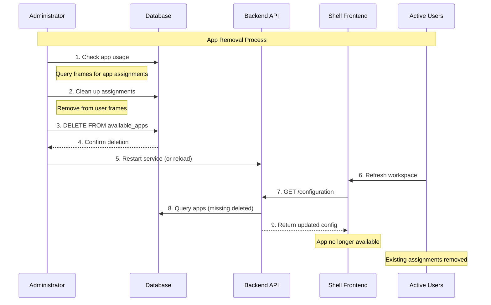
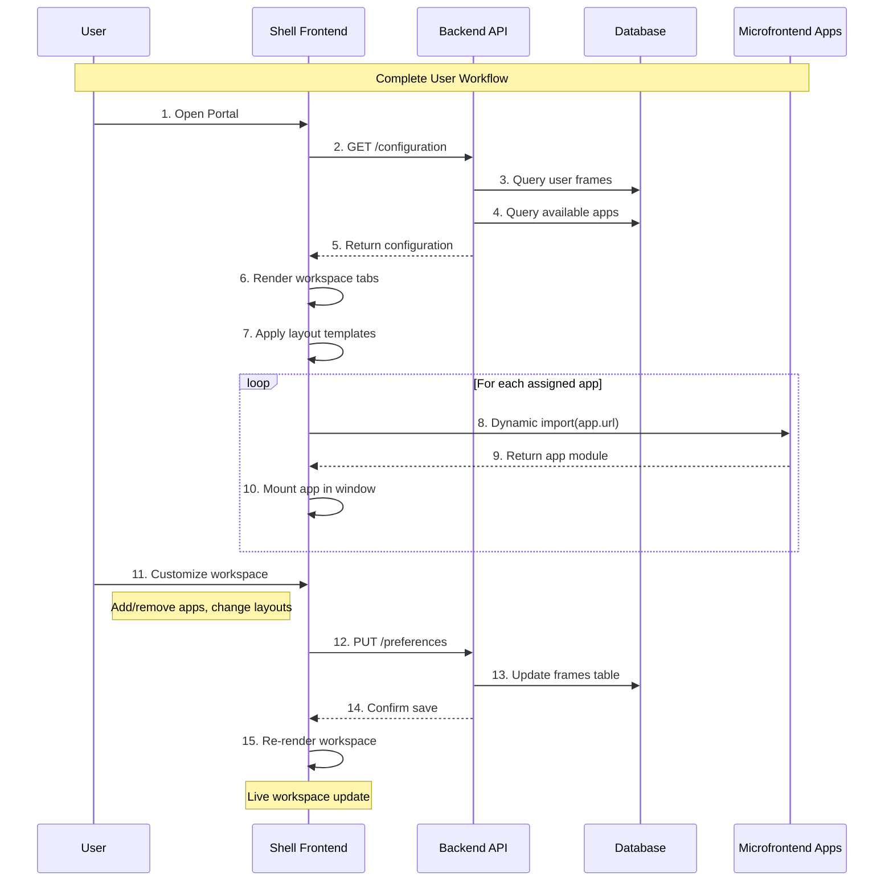

# AI MFE Portal Backend Service Guide

## Overview

The AI MFE Portal backend service is a FastAPI-based preferences and configuration management system that enables dynamic microfrontend orchestration. It provides user-specific workspace management, app registration, and layout templating capabilities.

**Architecture:** FastAPI + SQLite + JSON Configuration  
**Deployment:** Uvicorn ASGI server  
**Database:** SQLite (production-ready with PostgreSQL compatibility)  
**Port:** 8011 (configurable via environments.json)

## Domain Model

### Core Entities Class Diagram

```mermaid
classDiagram
    class AppDefinition {
        +string id
        +string name  
        +string scope
        +string module
        +string url
        +timestamp created_at
        +timestamp updated_at
    }
    
    class Frame {
        +string id
        +string user_id
        +string name
        +number order
        +string layout_id
        +timestamp created_at
        +timestamp updated_at
    }
    
    class AppAssignment {
        +string appId
        +number windowId
    }
    
    class LayoutDefinition {
        +string id
        +string name
        +string description
        +object containerStyle
    }
    
    class LayoutWindow {
        +number id
        +object style
    }
    
    class ServiceEndpoints {
        +string id
        +string job_config_service_url
        +timestamp created_at
        +timestamp updated_at
    }
    
    class ShellConfiguration {
        +Frame[] frames
        +AppDefinition[] availableApps
        +ServiceEndpoints serviceEndpoints
    }
    
    %% Relationships
    Frame ||--o{ AppAssignment : contains
    AppAssignment }o--|| AppDefinition : references
    Frame }o--|| LayoutDefinition : uses
    LayoutDefinition ||--o{ LayoutWindow : contains
    ShellConfiguration ||--o{ Frame : includes
    ShellConfiguration ||--o{ AppDefinition : includes
    ShellConfiguration ||--|| ServiceEndpoints : includes
```

### Entity Descriptions

#### **AppDefinition** - Microfrontend App Registry
- **Purpose:** Defines available microfrontend applications
- **Module Federation:** Contains scope/module for dynamic loading
- **URL Management:** Environment-configurable remoteEntry.js URLs
- **Storage:** `available_apps` table

#### **Frame** - User Workspace Tabs
- **Purpose:** User-customizable workspace containers
- **Multi-Tenant:** Scoped by `user_id` 
- **Ordering:** User-defined tab sequence
- **Layout Integration:** References layout templates
- **Storage:** `frames` table

#### **AppAssignment** - App-to-Layout Mapping
- **Purpose:** Maps apps to specific layout windows
- **Window Targeting:** 1-based window IDs within layouts
- **JSON Storage:** Embedded within Frame records

#### **LayoutDefinition** - UI Layout Templates
- **Purpose:** Pre-defined UI arrangements (single-pane, two-column, etc.)
- **CSS-Driven:** Complete styling definitions
- **Static Configuration:** JSON files, loaded at startup
- **Storage:** File system (`data/layouts/*.layout.json`)

## Database Schema

### Tables Overview



## Configuration Storage Strategy

The AI MFE Portal uses a **hybrid storage approach** with clear separation of concerns:

### Storage Separation by Data Type

| Data Type | Storage | Reason | Mutability | Scope |
|-----------|---------|---------|------------|--------|
| **Layout Templates** | JSON Files | Static, version-controlled, shared across all users | Read-only | Global |
| **App Definitions** | Database | Dynamic, environment-configurable, registered at runtime | Read/Write | Global |
| **User Preferences** | Database | User-specific, frequently changing, personal workspaces | Read/Write | Per-User |
| **Service Endpoints** | Database | Environment-specific, deployment configuration | Read/Write | Global |
| **Environment URLs** | JSON File | Deployment-specific overrides | Read-only | Environment |

### Configuration Hierarchy & Flow



### Why This Separation?

#### **JSON Files (Static Configuration)**
- **Layout Templates:** Design decisions that shouldn't change per deployment
- **Default Apps:** Initial app registry that gets copied to database
- **Environment URLs:** Deployment-specific overrides (dev/staging/prod)

#### **Database (Dynamic Configuration)**  
- **User Preferences:** Personal workspace configurations that change frequently
- **App Registry:** Apps can be added/removed without redeploying
- **Service Endpoints:** Runtime-configurable backend URLs

### Practical Example: Configuration Flow

When a user loads their workspace, here's what happens:



### Configuration Sources Example

For a typical workspace request, data comes from multiple sources:

#### **Static Sources (Files)**
```json
// shell_service/data/layouts/two-column.layout.json
{
  "id": "two-column",
  "name": "Two Column (50/50)", 
  "containerStyle": {"display": "flex"},
  "windows": [
    {"id": 1, "style": {"flex": "1 1 50%"}},
    {"id": 2, "style": {"flex": "1 1 50%"}}
  ]
}

// environments.json  
{
  "development": {
    "config-selector": {"url": "http://localhost:3103/src/main.tsx"}
  }
}
```

#### **Dynamic Sources (Database)**
```sql
-- User's workspace frames
SELECT * FROM frames WHERE user_id = 'john.doe';
-- Returns: Personal workspace configuration

-- Available apps registry
SELECT * FROM available_apps;
-- Returns: All registered microfrontend apps

-- Service endpoints
SELECT * FROM service_endpoints WHERE id = 'default';
-- Returns: Backend service URLs
```

#### **Final Configuration (API Response)**
```json
{
  "frames": [
    {
      "id": "workspace-1",
      "name": "Development",
      "layoutId": "two-column",  // ← From database (user choice)
      "assignedApps": [
        {"appId": "config-selector", "windowId": 1}  // ← From database
      ]
    }
  ],
  "availableApps": [
    {
      "id": "config-selector",
      "name": "Config Manager", 
      "url": "http://localhost:3103/src/main.tsx"  // ← From environment override
    }
  ],
  "layouts": [
    {
      "id": "two-column",  // ← From JSON file
      "windows": [...] 
    }
  ]
}
```

### Key Design Decisions

1. **JSON Storage for AppAssignments:** Enables flexible app-to-window mappings without complex join tables
2. **User-Scoped Frames:** Multi-tenant support via `user_id` column
3. **File-Based Layouts:** Static configuration for better performance and version control
4. **Flexible URLs:** Environment-override capability for deployment flexibility
5. **Hybrid Approach:** Balances performance (static) with flexibility (dynamic)

## App Registration & Management

### App Registration Flow



### Registration Methods

#### Method 1: Default Registration (Recommended)
1. **Edit Configuration:**
   ```json
   // shell_service/data/defaults.json
   {
     "available_apps": [
       {
         "id": "my-new-app",
         "name": "My New Application", 
         "scope": "myNewApp",
         "module": "./MyNewApp",
         "url": "http://localhost:3105/src/main.tsx"
       }
     ]
   }
   ```

2. **Reinitialize Database:**
   ```bash
   cd shell_service
   python scripts/init_prefs_db.py
   ```

3. **Restart Service:**
   ```bash
   python start_portal.py
   ```

#### Method 2: Direct Database Registration
```python
# Example: Direct database insertion
async def register_app_directly():
    app_data = {
        "id": "dynamic-app",
        "name": "Dynamically Registered App",
        "scope": "dynamicApp", 
        "module": "./DynamicApp",
        "url": "http://localhost:3107/src/main.tsx"
    }
    
    await db.execute(
        """
        INSERT INTO available_apps(id, name, scope, module, url)
        VALUES($1, $2, $3, $4, $5)
        ON CONFLICT (id) DO UPDATE SET
            name = EXCLUDED.name,
            scope = EXCLUDED.scope, 
            module = EXCLUDED.module,
            url = EXCLUDED.url,
            updated_at = CURRENT_TIMESTAMP
        """,
        app_data["id"], app_data["name"], app_data["scope"], 
        app_data["module"], app_data["url"]
    )
```

#### Method 3: Environment URL Override
```json
// environments.json
{
  "development": {
    "my-new-app": { "url": "http://localhost:3105/src/main.tsx" },
    "production-app": { "url": "https://cdn.example.com/app/main.js" }
  }
}
```

### App Removal Flow



### Removal Methods

#### Method 1: Safe Removal with Cleanup
```python
async def remove_app_safely(app_id: str):
    # 1. Find and clean up existing assignments
    frames_with_app = await db.execute(
        "SELECT id, assigned_apps FROM frames WHERE assigned_apps LIKE ?",
        f'%"{app_id}"%',
        fetch_type="all"
    )
    
    for frame in frames_with_app:
        # Parse and filter assignments
        assignments = json.loads(frame['assigned_apps'])
        filtered = [a for a in assignments if a['appId'] != app_id]
        
        # Update frame
        await db.execute(
            "UPDATE frames SET assigned_apps = ? WHERE id = ?",
            json.dumps(filtered), frame['id']
        )
    
    # 2. Remove app definition
    await db.execute(
        "DELETE FROM available_apps WHERE id = ?",
        app_id
    )
```

#### Method 2: Force Removal (Data Loss Warning)
```python
async def force_remove_app(app_id: str):
    # Direct deletion - may leave orphaned assignments
    await db.execute(
        "DELETE FROM available_apps WHERE id = ?", 
        app_id
    )
```

## API Endpoints

### Complete API Reference

#### Health & Status
```http
GET /health
Response: {
  "status": "healthy",
  "service": "AI MFE Portal Preferences Service", 
  "database_connected": true,
  "env_config_loaded": true,
  "layouts_found": 5
}
```

#### App Management
```http
GET /api/v1/shell/available-apps
Response: AppDefinition[]

# Example Response:
[
  {
    "id": "config-selector",
    "name": "Configuration Manager",
    "scope": "configSelector", 
    "module": "./ConfigManager",
    "url": "http://localhost:3103/src/main.tsx"
  }
]
```

#### User Configuration
```http
GET /api/v1/shell/configuration
Headers: X-User-Id: string
Response: ShellConfigurationResponse

# Example Response:
{
  "frames": [
    {
      "id": "workspace-1",
      "name": "Development", 
      "order": 0,
      "layoutId": "two-column",
      "assignedApps": [
        {"appId": "config-selector", "windowId": 1},
        {"appId": "job-management", "windowId": 2}
      ]
    }
  ],
  "availableApps": [...],
  "serviceEndpoints": {
    "jobConfigServiceUrl": "http://localhost:8000"
  }
}
```

#### Preferences Management
```http
PUT /api/v1/shell/preferences
Headers: X-User-Id: string
Content-Type: application/json
Body: ShellPreferencesRequest

# Example Request:
{
  "frames": [
    {
      "id": "new-workspace",
      "name": "My Custom Workspace",
      "order": 0, 
      "layoutId": "three-column",
      "assignedApps": [
        {"appId": "app1", "windowId": 1},
        {"appId": "app2", "windowId": 2}, 
        {"appId": "app3", "windowId": 3}
      ]
    }
  ]
}
```

#### Layout Management
```http
GET /api/v1/shell/layouts
Response: LayoutInfoResponse[]

GET /api/v1/shell/layouts/{layoutId}
Response: LayoutDefinition

# Example Layout Response:
{
  "id": "two-column",
  "name": "Two Column (50/50)",
  "description": "Two windows arranged side-by-side, equal width.",
  "containerStyle": {
    "display": "flex",
    "flexDirection": "row", 
    "height": "100%",
    "width": "100%",
    "gap": "8px"
  },
  "windows": [
    {"id": 1, "style": {"flex": "1 1 50%", "overflow": "auto"}},
    {"id": 2, "style": {"flex": "1 1 50%", "overflow": "auto"}}
  ]
}
```

## User Workflow Sequence

### Complete User Workspace Configuration



## Environment Configuration

### Multi-Environment Support

```json
// environments.json
{
  "development": {
    "prefs_service": { "url": "http://localhost:8011" },
    "shell": { "url": "http://localhost:3100" },
    "config-selector": { "url": "http://localhost:3103/src/main.tsx" },
    "job-management": { "url": "http://localhost:3104/src/main.tsx" }
  },
  "staging": {
    "prefs_service": { "url": "https://staging-api.example.com" },
    "shell": { "url": "https://staging.example.com" },
    "config-selector": { "url": "https://staging-mfe1.example.com/main.js" },
    "job-management": { "url": "https://staging-mfe2.example.com/main.js" }
  },
  "production": {
    "prefs_service": { "url": "https://api.example.com" },
    "shell": { "url": "https://app.example.com" },
    "config-selector": { "url": "https://cdn.example.com/mfe1/main.js" },
    "job-management": { "url": "https://cdn.example.com/mfe2/main.js" }
  }
}
```

### URL Resolution Priority
1. **Environment Override:** `environments.json` for current APP_ENV
2. **Database Default:** `available_apps.url` column
3. **Fallback:** Module Federation default resolution

## Development Operations

### Service Management

```bash
# Start backend only
python start_portal.py --backend-only

# Start with specific environment  
APP_ENV=staging python start_portal.py

# Database operations
cd shell_service
python scripts/init_prefs_db.py  # Initialize/reset database

# Health check
curl http://localhost:8011/health

# Test API endpoints
curl -H "X-User-Id: test-user" http://localhost:8011/api/v1/shell/configuration
```

### Debugging & Monitoring

#### Log Locations
- **Service Logs:** `shell_service.log` 
- **Database Logs:** Embedded in service logs
- **Startup Logs:** Console output during `start_portal.py`

#### Common Issues
1. **Database Lock:** Multiple processes accessing SQLite
2. **Missing Layout:** Layout file not found or invalid JSON
3. **App URL Resolution:** Environment vs database URL conflicts
4. **CORS Issues:** Frontend-backend communication errors

#### Monitoring Queries
```sql
-- App usage statistics
SELECT a.name, COUNT(f.id) as frame_count 
FROM available_apps a
LEFT JOIN frames f ON f.assigned_apps LIKE '%' || a.id || '%'
GROUP BY a.id, a.name;

-- User workspace complexity
SELECT user_id, COUNT(*) as frame_count,
       AVG(json_array_length(assigned_apps)) as avg_apps_per_frame
FROM frames 
GROUP BY user_id;

-- Layout popularity
SELECT layout_id, COUNT(*) as usage_count
FROM frames 
WHERE layout_id IS NOT NULL
GROUP BY layout_id
ORDER BY usage_count DESC;
```

## Security Considerations

### Authentication & Authorization
- **User Context:** `X-User-Id` header (implement authentication upstream)
- **Data Isolation:** All queries scoped by user_id
- **SQL Injection:** Parameterized queries throughout

### Data Validation
- **Pydantic Models:** Complete input validation
- **JSON Schema:** AppAssignment structure validation  
- **URL Validation:** App URL format verification

### Deployment Security
- **Database Permissions:** Read/write access control
- **Environment Variables:** Sensitive configuration externalization
- **CORS Configuration:** Restricted frontend origins
- **HTTPS Enforcement:** Production TLS requirements

## Performance Optimization

### Caching Strategy
- **Layout Templates:** In-memory cache (loaded at startup)
- **Environment Config:** Single load per service restart
- **Database Connections:** Connection pooling via aiosqlite

### Scaling Considerations
- **Database Migration:** SQLite → PostgreSQL for high concurrency
- **Service Clustering:** Multi-instance deployment with shared database
- **CDN Integration:** Static layout template distribution
- **App URL Caching:** Edge caching for microfrontend assets

---

## Quick Reference

### Essential Commands
```bash
# Service startup
python start_portal.py --services shell

# Database reset
cd shell_service && python scripts/init_prefs_db.py

# API testing
curl -H "X-User-Id: test" http://localhost:8011/api/v1/shell/configuration

# Health check
curl http://localhost:8011/health
```

### Key Files
- **Models:** `shell_service/models/preferences.py`
- **API Routes:** `shell_service/api/routes/shell.py` 
- **Database:** `shell_service/database/crud.py`
- **Configuration:** `shell_service/config.py`
- **Layouts:** `shell_service/data/layouts/*.layout.json`
- **Defaults:** `shell_service/data/defaults.json`

### Default Ports
- **Backend Service:** 8011
- **Shell Frontend:** 3100  
- **Test App:** 3106

This backend service provides the foundation for dynamic, user-customizable microfrontend orchestration with enterprise-grade features including multi-tenancy, environment management, and comprehensive API coverage.